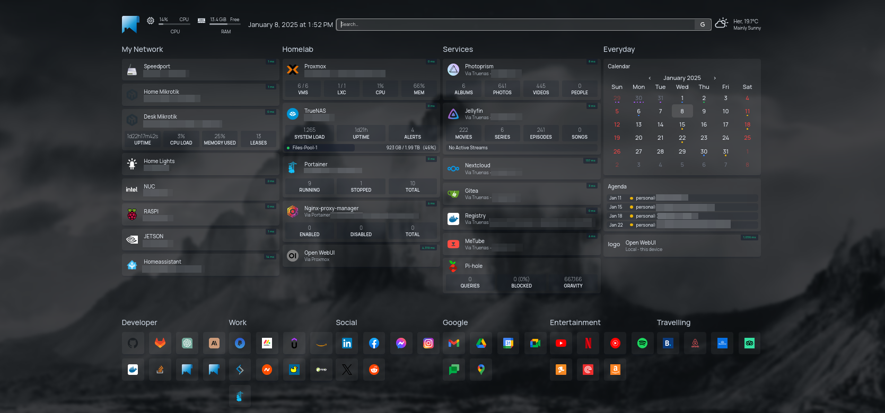

# Homepage

This repository contains the [Docker Compose](./docker-compose.yml) file along with my personal [configuration](./config/) for my [homepage](https://gethomepage.dev/) dashboard.



## Services
In my home network, I use multiple devices for various experiments and tests. This dashboard provides easy access to them and displays information at a glance.

The list of devices I use:
* My ISP router that provides internet access to my internal networks.
* Two [Mikrotik](https://mikrotik.com/) routers,  both behind NATs, which provide different subnets for various applications.
* An Intel NUC device that runs [TrueNAS](https://www.truenas.com/) and also accommodates:
    - [Photoprism](https://www.photoprism.app/) My photos/videos server
    - [Jellyfin](https://jellyfin.org/) My multimedia server
    - [Homepage](https://gethomepage.dev/) Another access point to this dashboard (for mobile devices, etc.).
    - [Gitea](https://about.gitea.com/) My self-hosted Git server
    - [Distribution](https://distribution.github.io/distribution/) My self-hosted docker registry
    - [Pi-hole](https://pi-hole.net/) Optional on premises DNS server
* Another x86 machine that runs [Proxmox](https://www.proxmox.com/en/). This machine is used for running:
    - [Portainer](https://www.portainer.io/) My go-to container manager.
      - [Kimai](https://www.kimai.org/) My project time-tracking tool.
      - [Nginx-proxy-manager](https://nginxproxymanager.com/) To manage my nginx proxy.
      - [it-tools](https://it-tools.tech/) A collection of useful IT tools deployed locally.
    - My homelab VMs for testing and experimentation.
    - An [Ollama](https://ollama.com/) server for on-premises LLM inference (see [my modelfiles for more](https://github.com/CSpyridakis/modelfiles)).
* A Raspberry Pi to run ARM-based experiments.
* A Jetson Nano SBC to accelerate code on NVIDIA GPUs during experiments related to embedded Linux edge devices.
* Another NUC device to leverage SGX or for experiments that need to be done on an x86 machine and cannot be performed on a VM for some reason (e.g., creating/running VMs using [Oracle VirtualBox](https://www.virtualbox.org/) and [Vagrant](https://www.vagrantup.com/)).

## Usage
In order to run your own homepage dashboard, make sure you have first read the official [documentation](https://gethomepage.dev/). This repository should only be used as a reference implementation. You can modify, change, and use the contents of this repository as needed without any notice.

Steps: 

1. Make sure that you have [docker](https://www.docker.com/) or [podman](https://podman.io/) installed on your system. 

2. Create your `.env` file to and modify it to include your secrets.
    ```
    cp .env.template .env
    ```

3. Modify [services-template.yaml](./config/services-template.yaml) and [bookmarks.yaml](./config/bookmarks.yaml) based on your needs.

4. Finally, run the container.
    ```
    ./RUNME
    ```
    
> [!NOTE]
> TODO: Create an index for future expansion
